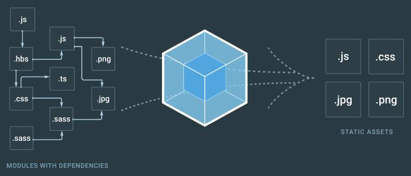

# webpack

## 目的

> 静态资源打包

## 设计思想

> 在自身提供打包构建能力的基础上通过各个构建节点的事件分发机制，使得用户在规定的loader和plugin规范下，通过订阅相应的事件完成差异的个性化构建。

<mermaid>
graph LR
  filesys(文件系统) --配置文件--> options
  subgraph webpack
    subgraph compiler
      options(初始化基本配置) --> applyplugin(插件初始化)
      options(初始化基本配置) --> hook(触发钩子)
    end
    subgraph complilation
      applyplugin --> run(运行webpack)
      run(运行webpack) --> hook(钩子调用)
      run --> compile(编译)
      compile --> hook
      compile --> emit(输出文件)
      emit --> hook
    end
  end
  emit --> filesys
</mermaid>

## 工作流程

<mermaid>
graph LR
compiler(compiler初始化webpack环境配置) --> compilation(compilation开启一次构建)
compilation --热更新--> compilation
</mermaid>

## 实现细节

1. [生命周期](./life_cycle.md)
2. [hrm](./hrm.md)
3. [module、chunk和bundle](./module_chunk_bundle.md)
4. [插件开发](./plugins.md)
5. [loader开发](./loader.md)
6. [loader执行顺序](./loader.md)
7. [分包](./split.md)
8. [hash](./hash.md)
9. [tree shaking](./tree_shaking.md)
10. [mainfest]()

## 常用插件

* [style-loader](https://www.npmjs.com/package/style-loader)：将js的css资源依赖插通过style标签插入到dom中。
* [css-loader](https://www.npmjs.com/package/style-loader)：解析js文件的css资源依赖。
* [file-loader](https://www.npmjs.com/package/style-loader)：解析文件依赖，将对应文件拷贝到输出目录，同时修改引用路径。
* [html-loader](https://www.npmjs.com/package/html-loader)：解析html文件依赖，将html文件解析为html字符串引入。
* [csv-loader](https://www.npmjs.com/package/csv-loader)：解析csv文件依赖，将html文件解析为html字符串引入。
* [xml-loader](https://www.npmjs.com/package/xml-loader)：解析html文件依赖，将html文件解析为html字符串引入。

* [html-webpack-plugin](https://www.npmjs.com/package/html-webpack-plugin)：html模板解析，资源注入插件。
* [clean-webpack-plugin](https://www.npmjs.com/package/clean-webpack-plugin)：目录清除插件。

## 问题

1. 太重。工作机制复杂，需要深入了解其工作机制才能够掌握其配置方式。